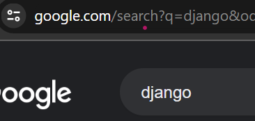

**In this section we will discuss how searching and filtering of rooms works in Study buddy**
- [How Searching Works](#how-searching-works)
- [Understanding GET method](#understanding-get-method)
- [Filtering](#filtering)
- [Searching](#searching)

## How Searching Works
In order for us to search or filter we need an additional querry variable which we will use to filter the database querry with.
We commony use the variable name as ``q`` which you can see in most of your common search functionalities including even in google searches.




## Understanding GET method
We use the get method for forms when we are not going to change any data in the backend but only going to retrieve data.
The get method helps us in retrieveing the q variable from the browser

## Filtering
Steps to configure filtering
1. Include the variable which you would like to filter by in the template(in study buddy we filter using the topic names)
  
1. Configure the q variabel for each of the topics using a for loop in the template
```html
    <a href="">All rooms </a>
    
      <a href="?q={{topic.name}}"><p>{{topic.name}}</p></a>
    
```
3. Querry the database including the filter

```python
def home(request):
  topics=models.Topic.objects.all()
  #retrieving the q variable
  q=request.GET.get('q')
  #querrying the rooms using q to filter
  #filter checks for the rooms that contain the topic name as the one in the q variable
  rooms=models.Rooms.object.filter(topic__name__icontains=q)
  context={
    'rooms':rooms,
    'topics':topics,
  }
  return render(request, 'base/home.html', context)
```

## Searching
Searching is very similar to filtering though we need to add a few more features such as a search bar in the navigartion panel which is majorly used to set the variable q to contain the text in the search input
```html
<form method="GET" action="">
  <input type="text" name="q" placeholder="Search Rooms">
</form>
```

When we submit the form we set the variable q to the request.GET.get('q') and if q is none we set it to an empty string that will allow us to view all the rooms after searching or filtering 
We can also search based off multiple parameters such as the host of the rooms and also the room name using the Q method which we will import

```python
from django.db.models import Q

def home(request):
  q=request.GET.get('q') if request.GET.get('q') != None else ''
  #querrying based of multiple parameters using Q method
  rooms=models.Rooms.objects.filter(
    Q(topic__name__icontains=q) |
    Q(name__icontains=q) |
    Q(host__username__icontains=q)
    )
  topics=models.Topic.objects.all()
  #Room count to show us how many rooms are available
  room_count=rooms.count()
  context={
    'rooms':rooms,
    'topics':topics,
    'room_count':room_count 
           }
  return render(request, 'base/home.html', context)
```